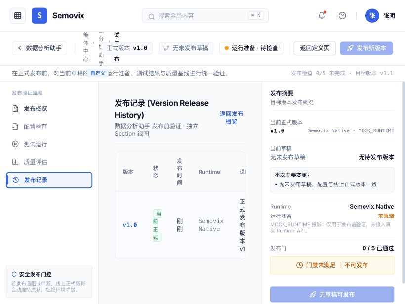

# 智能体配置产品流程与页面体验评审

评审日期：2026-08-29  
评审范围：智能体注册表、创建抽屉、定义工作区、测试与发布、发布后管理。  
评审口径：只从产品能力、页面信息和用户任务闭环判断；代码是否已经接入真实 Runtime 不是本报告的主判断依据。

## 1. 最终判断

当前产品完成的是：

```text
选择受管模板
→ 创建智能体草稿
→ 调整部分定义
→ 查看发布检查
→ 生成正式版本记录
```

但还没有完成：

```text
明确智能体组成
→ 配齐有效模型、知识、Skill、Tool 和权限
→ 真实试用并确认配置生效
→ 指定谁可以从哪里使用
→ 发布到正式入口
→ 监控、反馈、迭代和回滚
```

因此，即使当前所有页面都接上真实后台，用户按现有流程走完，也仍然不能完整交付一个“可用的企业智能体”。

当前更准确的产品定位是：

> **受管模板型智能体实例化与版本管理。**

它不是完整的“自定义智能体构建平台”。当前页面却同时使用“创建自定义智能体”“构建、配置、评估和发布企业智能体”等表述，容易让用户预期自己能够配置模型、Skill、Tool、知识、渠道和权限，形成产品承诺与实际信息架构不一致。

## 2. 一个真正可用的智能体，产品上必须回答什么

发布前，页面必须让 Owner 能够回答以下八个问题：

1. 它为谁解决什么问题？
2. 它遵循什么角色指令和行为边界？
3. 它最终使用什么模型能力？
4. 它依靠哪些知识、Skill 和 Tool 完成任务？
5. 它以谁的身份访问哪些资源，可以读还是可以写？
6. 用户或系统从哪里发起任务？
7. 如何证明当前配置能够完成承诺任务？
8. 上线后如何监控、停用、回滚和持续改进？

当前页面较完整地回答了第 1、2 项的一部分；第 3、4、5、6 项明显不足；第 7 项只有发布检查展示；第 8 项基本缺失。

## 3. 大模型、Skill 等配置到底是否必需

关键原则是：

> **每项关键配置可以由用户手工选择，也可以由模板或组织策略继承，但发布前必须解析成明确、可见、可验证的“有效配置”。**

| 配置对象 | 是否必须存在 | 是否必须让业务用户手工配置 | 当前产品判断 |
|---|---|---|---|
| 名称、用途、Owner | 必须 | 必须确认 | 已有 |
| Agent 指令与行为边界 | 必须 | 模板可预填，Owner 必须查看和确认 | 有，但被藏在“高级角色说明” |
| 有效大模型或模型路由 | 必须 | 不一定，可以继承组织模型策略 | 只有“质量优先”等抽象名称，看不到最终生效能力 |
| Task | 至少一个 | 模板可预装，Owner 确认启用 | 已有启停，但缺输入输出和依赖说明 |
| Skill | 按任务条件必需 | 模板可自动装配 | 没有查看或绑定入口 |
| Tool / Connector | 涉及查询或动作时必需 | 模板可预装，但必须确认连接、权限和审批 | 没有查看或绑定入口 |
| 知识库与业务数据 | 知识和数据型智能体必需 | 需要选具体资源或继承明确范围 | 只到业务域，未到知识空间、数据资产或连接状态 |
| 会话上下文 | 必须有默认 | 通常不需要普通用户细调 | 页面不可见 |
| 长期记忆 | 可选，默认建议关闭 | 开启时必须配置保存和隔离规则 | 缺失 |
| 使用人群与管理权限 | 必须 | 可继承，但必须可见 | 缺失 |
| 执行身份与资源权限 | 使用 Tool/知识时必须 | 组织可提供默认身份 | 缺失 |
| 使用渠道或触发方式 | 发布时至少一个 | 必须选择或确认默认入口 | 缺失 |
| 输出格式与失败处理 | 必须有默认 | 结构化任务需要显式配置 | 缺失 |
| 测试集和质量阈值 | 生产发布前必须 | Owner/测试人必须确认 | 只有只读结果展示 |
| 审批、版本和回滚 | 企业发布必需 | 依组织流程配置 | 有版本，缺审批、Diff 和回滚 |

### 3.1 是否要配置大模型

**必须存在有效模型配置，但不应强迫所有业务用户直接选择底层厂商和技术参数。**

建议采用两层产品模型：

- 平台管理员管理模型供应商、部署、凭据、地域、配额、成本和备用模型。
- 智能体 Owner 选择“模型配置档案”或业务策略，并能看到最终生效结果。

Owner 页面至少应展示：

- 配置来源：模板继承、组织默认或当前智能体覆盖。
- 实际生效的模型档案或模型能力等级。
- 是否支持 Tool Calling、长上下文、多模态和结构化输出。
- 主模型不可用时的降级策略。
- 质量、延迟和成本档位。
- 是否与当前任务、Skill 和 Tool 兼容。

Temperature、Top-P、API Key、Base URL 等不应出现在普通业务用户主流程，可以放在平台管理或高级策略中。

### 3.2 是否要配置 Skill 和 Tool

不是每个智能体都需要业务用户手工添加 Skill 或 Tool，但页面必须把它们作为智能体组成的一部分展示出来。

- 纯对话智能体可以没有业务动作 Tool。
- 企业知识问答必须有检索 Skill 和具体知识来源。
- 数据分析智能体必须有元数据检索、指标查询、SQL/计算等 Skill 或 Tool。
- 语义治理智能体必须有治理工作流、治理 Tool 和人工审批节点。

模板可以自动装配，但 Owner 至少要看到：名称、版本、用途、所支撑任务、所需权限、连接状态、最近验证结果、是否自动执行以及是否需要人工确认。

当前产品把 Task、能力模板和能力模式放在显著位置，却没有回答“靠什么完成”，这是当前最大的配置缺口。

## 4. 当前页面逐步评审

### Step 1：智能体注册表——部分健康


优点：名称、职责、任务、版本、状态、Owner 和创建入口清楚。

问题：注册表没有回答“谁可以使用、在哪里使用、当前运行是否健康”。操作菜单只有定义工作区和版本记录，缺少立即试用、访问配置、停用、复制、监控和反馈。

### Step 2：选择能力模板——流程清晰，模板内容不透明


两步式创建和模板起点是合理的。但模板只介绍任务和默认行为，没有说明它会带入哪些模型策略、Skill、Tool、知识依赖、安全规则和使用限制。用户只能按名称猜测模板是否真的能够完成目标。

建议在模板卡增加“模板将带入”：

```text
任务 3 项 · Skill 4 项 · Tool 2 项
模型档案：逻辑推理型
需要：指标注册表、语义层连接
执行权限：只读
默认交付：平台对话入口
```

### Step 3：创建基础草稿——适合快速开始，但不是完整配置


名称、职责、Owner、工作范围和右侧摘要的组合比较清楚，CTA“创建草稿并继续配置”也正确管理了预期。

问题：默认范围偏宽；Owner 在这里像组织选择器，进入定义页后却变成自由文本；右侧摘要仍不展示模型、Skill、Tool、知识依赖和权限。

### Step 4：定义概览——完成度判断不完整


当前只用“基础定义、工作范围、发布验证”三项判断是否完成，容易让用户认为配置已经基本齐全。

企业级完成度至少应包含：指令、模型、知识、Skill/Tool、权限身份、渠道、测试、审批与监控。右侧还应区分“模板继承、组织默认、当前覆盖”。

### Step 5：基本信息与角色指令——角色指令不应被降级成高级项


角色指令决定智能体如何工作，是核心必配内容，不应以“高级角色说明”折叠隐藏。建议改名为“智能体指令与边界”，并增加目标、输入、输出、必须遵守、禁止行为、证据不足和失败处理等结构化辅助。

交互上还缺少统一的“未保存”状态和离开提醒。实测修改名称后直接离开工作区，页面没有提示，重新进入后修改已丢失。

### Step 6：支持任务——能启停，不能判断任务是否可执行


任务启停和版本编号是好的基础，但“查看任务定义”只提示去 Task Engine，没有真正进入详情。

即使任务定义由别的模块维护，本页也应只读展示：输入、输出、前置 Skill/Tool、知识依赖、失败处理、人工审批、当前兼容性和最近验证结果。

### Step 7：工作范围——只配置到业务域，不足以定义知识和数据


“智能体范围 ∩ 用户权限 ∩ 任务范围”的说明很好，但当前粒度只到人口主题域、公共服务域等业务域。

知识与数据型智能体还需要：具体知识空间/数据资产、版本和更新时间、索引状态、检索方式、引用策略、无答案策略、读写权限和连接健康。

### Step 8：能力模式——实际是只读标签，不是能力装配


页面只有一个不可调整的“指标计算与多维归因”标签。用户无法查看它具体包含哪些 Skill、Tool、检索策略和限制。

建议把“能力模式”改成能力包摘要，并允许进入只读清单；有权限的 Owner 可以在受管目录中添加或移除兼容组件。

### Step 9：能力与技能入口——未形成页面


点击侧栏“能力与技能”后仍停留在注册表，仅出现“当前挂载 18 项”的消息。这是明显的导航承诺落空。

页面声称存在 Skill、Tool 和知识连接器，但用户不能搜索、查看、检查版本、连接状态或绑定到智能体，因此 Skill 生命周期没有闭环。

### Step 10：模型与自主程度——有业务策略，但没有有效模型信息


当前模型页提供“均衡、质量优先、逻辑与计算优先、严谨一致性优先”等策略，方向上比让业务用户直接选择厂商更合适。

但页面必须补充策略解析后的有效模型、能力兼容性、成本延迟档位、降级方案和配置来源。否则用户无法判断当前模型是否支持已选任务和 Tool。

“自主程度”也应改为动作矩阵：读取、查询、生成、写入、发送、发布分别是自动执行、人工确认还是禁止，而不是一句抽象描述。

### Step 11：测试与发布——发布门清楚，测试工作台缺失


发布概览、变更摘要和门禁结构清晰。但页面第一次真正谈到验证时，已经进入发布阶段，发现问题太晚。

配置工作区应始终提供 Playground；发布页负责汇总验收，不应成为第一次判断配置是否有效的地方。

### Step 12：测试运行——只读报告，不是用户试用


当前没有输入框、运行按钮、重试、保存用例、正式版对比、Trace、知识引用、Skill/Tool 调用或成本耗时。用户没有真正完成“我亲自试过当前草稿”的任务。

标准体验应支持正常、无知识、无权限、Tool 失败、危险请求和提示注入等场景，并显示每一步实际使用的配置。

### Step 13：发布确认——缺少交付决策


弹窗总结了版本、Runtime、变更和五项检查，但没有要求用户确认：发布环境、使用人群、使用渠道、访问身份、发布说明、审批人、灰度范围和回滚目标。

因此当前“发布”更像保存版本，而不是把智能体交付给正式用户。

### Step 14：发布后——版本生成了，但用户不知道去哪里使用



发布后仍停留在测试与发布工作区，只显示版本记录。没有“立即试用、打开正式入口、复制 API、查看嵌入方式、查看监控”中的任何一项。

版本历史也缺少配置 Diff、发布人、审批记录、目标渠道、回滚和停用操作。这是当前业务闭环最直接的断点。

## 5. 推荐的完整产品流程

### 5.1 快速创建

```text
选择空白或受管模板
→ 预览模板包含的模型、任务、Skill、Tool、知识依赖和安全规则
→ 填写名称、用途、Owner、目标使用人群
→ 创建私有草稿
```

### 5.2 组装有效智能体

```text
身份与行为指令
→ 任务与输出契约
→ 知识与数据
→ Skill 与 Tool
→ 模型与记忆
→ 权限与执行身份
→ 使用渠道与触发方式
→ 安全与人工确认
```

每一页都应显示三种来源：

```text
模板继承 / 组织默认 / 当前智能体覆盖
```

并在右侧实时生成“最终有效配置摘要”。

### 5.3 边配边试

配置工作区保持常驻 Playground：

```text
输入测试任务
→ 查看回答和输出
→ 查看知识引用
→ 查看 Task 路由
→ 查看 Skill / Tool 调用
→ 查看使用身份和权限
→ 查看耗时、成本和失败原因
→ 保存为回归用例
```

### 5.4 验收与交付

```text
运行测试集和安全用例
→ 对比候选草稿与正式版本
→ 确认质量阈值
→ 选择环境、使用人群和渠道
→ 审批
→ 发布
→ 从正式入口立即试用
```

### 5.5 发布后运营

```text
用户调用
→ 记录 Trace、结果与反馈
→ 监控成功率、质量、延迟、成本和安全事件
→ 失败样本沉淀为测试集
→ 创建新草稿
→ 重新评估
→ 灰度发布或回滚
```

## 6. 建议的信息架构

定义工作区建议调整为：

1. 概览与完成度。
2. 身份与行为指令。
3. 任务与输出契约。
4. 知识与数据。
5. Skill 与 Tool。
6. 模型与记忆。
7. 权限与执行身份。
8. 渠道与触发方式。
9. 安全与自主程度。
10. 测试与评估。
11. 发布、版本与回滚。
12. 运行洞察与反馈。

这不意味着所有步骤都要强迫用户从零填写。模板型产品可以大量预填，但每个关键配置都必须可见、可解释、可验证。

## 7. 改造优先级

### P0：不补就不能形成业务闭环

1. 明确产品定位：受管模板型 Builder，还是通用自定义 Builder；同步页面文案。
2. 增加有效配置摘要，展示模型、Skill、Tool、知识、权限和配置来源。
3. 增加 Skill/Tool 与具体知识资源的查看和配置页。
4. 增加使用人群、执行身份、正式渠道和触发方式。
5. 在配置工作区增加真实 Playground，而不是只读测试报告。
6. 发布时增加环境、渠道、人群、审批和发布说明。
7. 发布成功后提供正式试用入口，并可查看监控。

### P1：提升可理解性和管理效率

1. 将“高级角色说明”提升为核心“智能体指令”。
2. 将“自主程度”改为具体动作权限矩阵。
3. 为任务展示输入输出、依赖、审批和兼容状态。
4. 统一 Owner 的选择方式和数据口径。
5. 加入未保存状态、离开提醒和实时摘要。
6. 版本页增加 Diff、发布人、审批记录、回滚和停用。

### P2：体验和无障碍完善

1. 模板卡使用标准可聚焦的单选控件，而不是只有视觉 Radio。
2. 表格整行操作和悬停信息提供键盘入口。
3. 为状态变化、校验结果和发布进度提供读屏可感知反馈。
4. 验证窄屏、缩放、固定三栏和长文本的重排表现。

## 8. 最终产品结论

当前页面并非完全错误：两步创建、草稿、定义工作区、发布门和版本概念都适合作为骨架。

真正的问题是：

> **它让用户配置了“智能体要做什么”，但没有完整配置“靠什么做、以什么权限做、在哪里提供服务、如何证明做得到”。**

因此当前流程只能闭环到“生成正式版本”，不能闭环到“交付一个可用的企业智能体”。

## 9. 证据边界

本报告基于本次审计中实际操作和保存的页面截图。键盘完整路径、读屏语义、焦点顺序、缩放重排、网络异常、多人并发编辑和真实权限差异仍需专项测试，不能据此宣称满足完整 WCAG 或企业安全标准。
